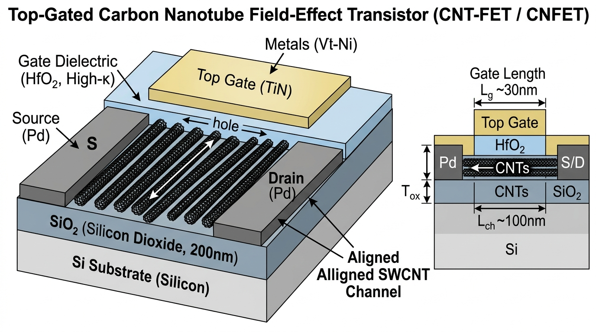
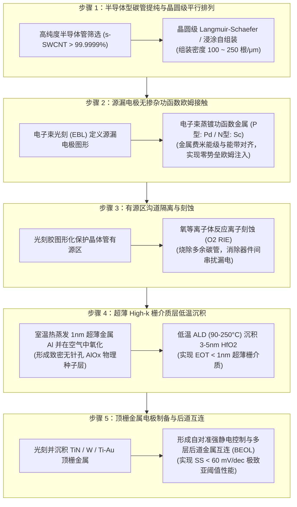

# Carbon Nanotube FET Fabrication & Contact Engineering
> **中文概念**：*碳纳米管场效应晶体管制造工艺、微观输运物理与接触工程*

---

## 🖼️ 器件三维架构与剖面图 (3D Device Schematic)

*图 1：顶栅碳纳米管场效应晶体管（Top-Gated CNT-FET）3D 剖面与横截面示意图。展示了在 $\text{SiO}_2/\text{Si}$ 衬底上高密度平行排列的一维碳纳米管沟道、源漏欧姆电极、超薄 $\text{HfO}_2$ 栅介质层与 $\text{TiN}$ 顶栅。*

---

### 🔍 3D 架构图各层组件与几何参数逐一深度解析 (3D Diagram Component Breakdown)

结合上方 3D 示意图与右侧横截面（Cross-section），器件各组成部分的功能与微观物理意义如下：

1. **底衬底与绝缘隔离层 ($\text{Si}$ Substrate & $\text{SiO}_2, 200\text{ nm}$)**：
   - **位置**：器件最底部的灰色和深蓝色基底。
   - **功能**：底部为高导电性硅晶圆衬底（可作为全芯片公共背栅 Global Back-Gate 用于器件调试）；表面生长 $200\text{ nm}$ 的热氧化 $\text{SiO}_2$ 绝缘隔离层，用于彻底隔离源漏电极与衬底，将衬底寄生漏电与电容降至最低。
2. **一维碳纳米管沟道 (Aligned SWCNT Channel)**：
   - **位置**：中间黑色圆柱状细管阵列。
   - **功能**：由单壁碳纳米管（$\text{SWCNT}$，直径 $d \approx 1.2\text{ nm}$）紧密平行排列而成（沟道长度 $L_{ch} \approx 100\text{ nm}$）。图中白色箭头标注了 **空穴（hole）** 的定向输运方向。碳管内部无杂质散射，平均自由程 $\lambda_{mfp} > 100\text{ nm}$，室温下呈现超高速准弹道输运。
3. **源漏欧姆接触电极 (Source / Drain Contacts - $\text{Pd}$)**：
   - **位置**：碳管两端的深灰色金属方块，分别标记为 **$\text{S}$ (Source)** 和 **$\text{D}$ (Drain)**。
   - **功能**：对于 P 型晶体管，采用高功函数金属钯（$\text{Pd}$，$\Phi_M \approx 5.1\text{ eV}$）。金属电子波函数与碳管价带实现无缝杂化，形成**零肖特基势垒**的欧姆接触，使接触电阻降低至 $R_c < 100\ \Omega\cdot\mu\text{m}$。
4. **超薄高介电常数栅介质层 (Gate Dielectric - $\text{HfO}_2, \text{High-}\kappa$)**：
   - **位置**：覆盖在碳管阵列上方的淡蓝色半透明介质薄膜。
   - **功能**：采用低温原子层沉积（ALD）制备的 $3 \sim 5\text{ nm}$ 高介电常数氧化铪（$\text{HfO}_2$，相对介电常数 $\kappa \approx 25$），实现等效氧化层厚度 $\text{EOT} < 1\text{ nm}$。在提供极强静电场控制的同时，有效抑制量子力学栅极直接隧穿漏电。
5. **顶栅控制金属电极 (Top Gate - $\text{TiN}$ / Metals $\text{Vt-Ni}$)**：
   - **位置**：栅介质层正上方最顶部的黄色金属块。
   - **功能**：采用氮化钛（$\text{TiN}$）或功函数调节金属层（$\text{Vt-Ni}$），施加微小栅压即可在碳管表面建立强垂直电场，实现对一维圆柱沟道的超强包覆式静电开启与关断。
6. **右侧剖面图几何关键参数 (Geometric Metrics)**：
   - **物理栅长 ($L_g \sim 30\text{ nm}$)**：顶栅电极沿输运方向的物理宽度，决定了晶体管的微缩技术节点。
   - **沟道长度 ($L_{ch} \sim 100\text{ nm}$)**：源极与漏极金属电极之间的物理间距。
   - **栅介质物理厚度 ($T_{ox}$)**：$\text{HfO}_2$ 绝缘层的物理厚度（$\sim 3-5\text{ nm}$）。

---

## 1. 问题背景与文献原句 (Originating Context & Excerpt)
- **文献出处**：[[Sources/Papers/2022_Cheng_FET-Benchmark]] (Nature Electronics 2022, 彭练矛院士/张志勇教授/Curt Richter/Eric Pop 等合著)
- **精读疑问**：碳纳米管（CNT）是如何从材料筛选、高密度定向排列到源漏接触一步步制作成场效应晶体管（FET）的？其极性调控微观机制与传统硅基掺杂退火有何本质异同？
- **文献原句摘录**：
  > [!quote] 文献原句摘录 (Excerpt)
  > "Emerging 1D carbon nanotubes and 2D semiconductors offer supreme electrostatic control and ballistic transport, where contact resistance extraction and alignment uniformity dictate the standardized benchmarking against sub-1nm silicon CMOS."

---

## 2. 完整制造工艺全流程解析 (Full 5-Step Fabrication Process)

将单壁碳纳米管（SWCNTs）制造为高性能数字逻辑晶体管的完整 5 步流程如下：

### 5 大工艺步骤核心技术要点：

1. **高纯度半导体型碳管筛选与定向排列 (Semiconducting Purification & Array Assembly)**：
   - **微观瓶颈**：高温 CVD 合成的碳管包含约 $1/3$ 金属性碳管（m-CNT）与 $2/3$ 半导体型碳管（s-SWCNT）。金属性碳管无带隙，混入沟道会导致严重源漏直通短路。
   - **工艺方案**：利用特异性共轭聚合物（如聚噻吩 PFO-BPy）选择性分散半导体型碳管，经多级超速离心，获得半导体纯度 $>99.9999\%$ 的均一分散液；随后通过浸涂自组装（Dip-coating）或 Langmuir-Schaefer 界面压缩技术，在表面修饰有自组装单分子层（SAM）的晶圆上组装出排列密度达 $100 \sim 250\text{ 根}/\mu\text{m}$ 的单层平行阵列。
2. **源漏电极（Source/Drain）无掺杂功函数接触工程 (Workfunction-Engineered Ohmic Contacts)**：
   - **CMOS 极性调控**：完全摒弃传统硅基千度高温离子注入（Ion Implantation），利用**金属真空功函数（$\Phi_M$）与碳管能带对齐**：
     - **P 型场效应晶体管 (p-FET)**：采用高功函数金属（如钯 $\text{Pd}$、铂 $\text{Pt}$），$\Phi_M \approx 5.1\text{ eV}$ 与碳管价带顶（$E_v$）完美对齐，形成无肖特基势垒的空穴欧姆注入；
     - **N 型场效应晶体管 (n-FET)**：采用低功函数金属（如钪 $\text{Sc}$、钇 $\text{Y}$、铒 $\text{Er}$），$\Phi_M \approx 3.5\text{ eV}$ 与碳管导带底（$E_c$）无势垒对齐，实现纯电子欧姆注入。
3. **有源区沟道隔离与刻蚀 (Active Channel Patterning & RIE Isolation)**：
   - 使用光刻胶保护器件源漏与沟道区域，暴露区域采用氧等离子体反应离子刻蚀（$\text{O}_2$ RIE），在低温下将多余碳纳米管瞬间氧化为 $\text{CO}_2$ 挥发去除，实现器件间的完全电气隔离。
4. **超薄高介电常数（High-k）栅介质层集成 (Dielectric Deposition via ALD)**：
   - **表面悬挂键缺失挑战**：碳管表面缺乏化学悬挂键，气相 ALD 前驱体（如 TDMAHf 与 $\text{H}_2\text{O}$）无法直接均一成核。
   - **工艺突破**：在室温下热蒸镀 $1\text{ nm}$ 超薄金属铝（$\text{Al}$），在空气中完全氧化为致密非晶态 $\text{AlO}_x$ **物理种子层**；随后利用 ALD 在 $90 \sim 250^\circ\text{C}$ 下沉积 $3 \sim 5\text{ nm}$ 高介电常数 $\text{HfO}_2$ 或 $\text{ZrO}_2$，实现等效氧化层厚度 $\text{EOT} < 1.0\text{ nm}$ 且栅漏电流 $I_{gate} < 10^{-4}\text{ A/cm}^2$。
5. **顶栅电极制备与后道多层互连 (Top-Gate Metallization & BEOL)**：
   - 在 High-k 栅介质上方光刻并沉积栅极金属（$\text{TiN}$、$\text{W}$ 或 $\text{Ti/Au}$），构建顶栅自对准或局部重叠结构，实现亚 60 mV/dec 极致亚阈值摆幅与超低关态漏电。

---

## 3. 微观物理机制与数学理论推导 (Microscopic Transport Physics & Equations)

- **[EN]**: The 1D cylindrical geometry of SWCNTs ($d \approx 1.2\text{ nm}$) enables near-unity carrier injection velocity and ultimate electrostatic gate confinement. Ballistic transport dominates when channel length $L_{ch}$ is shorter than the acoustic phonon mean free path ($\lambda_{mfp} > 100\text{ nm}$), yielding an injection velocity $v_{inj} \approx 3.0 \times 10^7\text{ cm/s}$ ($>3\times$ higher than Silicon CMOS).
- **[CN] 物理机制与核心内涵**: 碳纳米管独特的无缺陷一维晶格使载流子在室温下具备超长平均自由程（$\lambda_{mfp} > 100\text{ nm}$）。当晶体管栅长缩减至亚 50 纳米时，沟道输运完全进入**准弹道输运状态（Quasi-Ballistic Transport）**，其驱动电流不再由低场漂移迁移率受限，而是由源极虚源（Virtual Source）处的**弹道载流子注入速度 $v_{inj}$** 绝对主导。

### 核心物理方程式：

1. **弹道注入速度方程 (Ballistic Injection Velocity)**：
   $$
   v_{inj} = \sqrt{\frac{2 k_B T}{\pi m^*}} \cdot \frac{\mathcal{F}_{1/2}(\eta)}{\mathcal{F}_0(\eta)} \approx 3.0 \times 10^7\text{ cm/s}
   $$
   *(式中 $m^* \approx 0.05 m_0$ 为碳管超轻有效质量，$\mathcal{F}_j(\eta)$ 为费米-狄拉克积分，$\eta = (E_F - E_c)/k_B T$ 为源极简并度)*

2. **单位宽度饱和驱动电流密度 (Normalized Saturation Drive Current)**：
   $$
   \frac{I_{on}}{W} = q \cdot n_{1D} \cdot v_{inj} \cdot D_{cnt}
   $$
   *(式中 $n_{1D}$ 为单管载流子线密度，$D_{cnt}$ 为碳管阵列组装密度，单位为 $\text{根}/\mu\text{m}$。当 $D_{cnt} \approx 200\text{ 根}/\mu\text{m}$ 时，实测 $I_{on}/W$ 可突破 $2.0\text{ mA}/\mu\text{m}$，超越同尺寸硅基 GAAFET)*

3. **一维静电特征微缩长度 (1D Electrostatic Natural Length)**：
   $$
   \lambda_{1D} = \sqrt{\frac{\varepsilon_{cnt}}{2 \varepsilon_{ox}} d_{cnt} t_{ox} \ln\left(\frac{4 t_{ox}}{d_{cnt}}\right)} < 1.0\text{ nm}
   $$
   *(极小的 $\lambda_{1D}$ 确保在 $L_g \approx 5\text{ nm}$ 物理栅长下漏极诱导势垒降低 $\text{DIBL} < 40\text{ mV/V}$，彻底根绝短沟道效应)*

---

## 4. 传统硅基技术深度对照矩阵 (Silicon Microelectronics Analogy Matrix)

| 物理与工程对照维度 | 传统硅基先进 CMOS (FinFET / GAAFET / CFET) | 碳纳米管晶体管 (CNT-FET / CNFET) | 差异本质与工程优劣势 |
| :--- | :--- | :--- | :--- |
| **1. 物理微缩与静电控制** | 3D 体硅纳米片 ($t_{si} \approx 5\text{ nm}$)，受限表面粗糙散射与量子限域 | **1D 圆柱纳米线 ($d \approx 1.2\text{ nm}$)**，超薄特征长度 $\lambda < 1\text{ nm}$ | CNT 静电微缩极限优于硅纳米片，DIBL 极低 |
| **2. 欧姆接触与极性调控** | 高温离子注入退火 ($>900^\circ\text{C}$) + 自对准硅化物 (NiSi/TiSi) | **金属功函数能带对齐（Pd 做 P 型 / Sc 做 N 型）** | CNT 免去离子注入晶格损伤，但低功函数金属易氧化 |
| **3. 载流子输运与驱动电流** | 声子+粗糙散射严重，$v_{inj} \sim 1.0 \times 10^7\text{ cm/s}$ | **准弹道输运（$\lambda_{mfp} > 100\text{ nm}$）**，$v_{inj} \sim 3.0 \times 10^7\text{ cm/s}$ | CNT 驱动电流密度 $I_{on}/W$ 理论上可达硅基 2~3 倍 |
| **4. 单片 3D 集成与热预算** | 前道（FEOL）高温工艺，**严禁后道多层单片 3D 堆叠** | **全低温制造工艺（$<400^\circ\text{C}$）**，天然支持 BEOL 多层堆叠 | CNT 可直接在已有芯片金属层上方堆叠多层逻辑单元 |
| **5. 产业化成熟度与量产良率** | **12 英寸晶圆量产良率 $>99.999\%$**，光刻自对准极其成熟 | **阵列组装均一性与金属性碳管（m-CNT）残留是死穴** | 硅基处于绝对工业统治地位；CNT 受制于材料纯度 |
| **6. 紧凑模型与寄生效应** | BSIM-CMG 工业级成熟标准模型 | 研发阶段 Virtual Source (VS-CNFET) 模型 | CNT 需特别优化电极交叠寄生电容与接触去嵌套 |

---

## 5. 关键实验与提取方法 (Experimental Metrology & Characterization)
- **测试与表征手段**：
  1. **共振拉曼光谱（Resonant Raman Spectroscopy - RBM 径向呼吸模）**：精确测定碳管手性指数 $(n, m)$ 与管径分布，监控半导体纯度；
  2. **高分辨原子力显微镜（AFM）与扫描电镜（SEM）**：统计碳管晶圆表面排列密度（严格要求 $D_{cnt} > 150\text{ 根}/\mu\text{m}$ 且角度偏角 $< 5^\circ$）；
  3. **传输线模型（Transfer Length Method - TLM）**：变栅压提取单位接触电阻 $R_c \cdot W$（目标 $R_c < 100\ \Omega\cdot\mu\text{m}$）与方块电阻 $R_{sh}$；
  4. **变温电学输运测试（Temperature-dependent $I-V$）**：通过 Richardson 曲线拟合提取金属/碳管界面的实际肖特基势垒高度 $\Phi_B$。

---

## 6. 局限性与产业化开放挑战 (Limitations & Future Challenges)
- **适用边界与关键瓶颈**：
  1. **半导体型纯度要求极端（The 99.9999% Ceiling）**：在包含 10 亿晶体管的微处理器芯片中，金属性碳管含量必须低于百万分之一，否则单管漏电即导致芯片报废；
  2. **晶圆级绝对定向排列与密度均一性**：溶液浸涂受表面张力与微区流场扰动影响，容易产生局部碳管交叉、间隙与团聚；
  3. **N 型低功函数金属（Sc/Y）的空气不稳定性**：钪/钇极易在大气中氧化退化，必须在超高真空腔内原位生长钝化保护层。

---

## 7. 双向链接与参考文献 (Bidirectional Links & References)
- **溯源论文**：[[Sources/Papers/2022_Cheng_FET-Benchmark]] *(How to report and benchmark emerging field-effect transistors, Nature Electronics 2022)*
- **关联概念卡片**：
  - [[Knowledge/Concepts/contact_resistance_extraction|Contact Resistance Extraction in 2D Transistors]]
  - [[Knowledge/Concepts/emerging_fet_benchmarking|Emerging FET Benchmarking Guidelines]]
  - [[Knowledge/Concepts/two_dimensional_transistor_scaling|Two-Dimensional Transistor Scaling and Natural Length]]
- **技术对照卡片**：
  - [[Knowledge/Comparisons/2d_contact_vdW_vs_silicon_silicide|2D vdW & Semi-Metal Contacts vs. Silicon Silicide Metallization]]
- **领域综合导航**：
  - [[Knowledge/Literature Overview|Literature Overview (文献全景概览)]]
  - [[Knowledge/Method Taxonomy|Method Taxonomy (方法学分类法)]]
