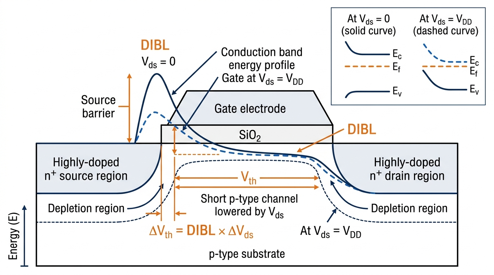
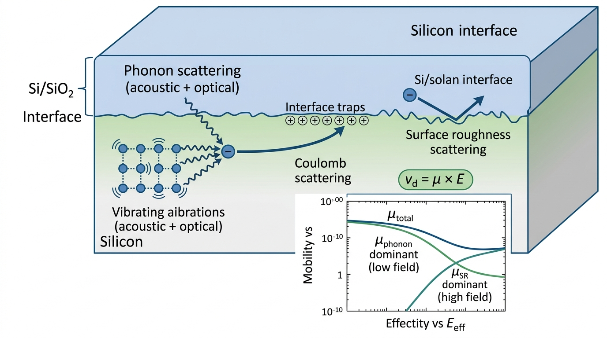
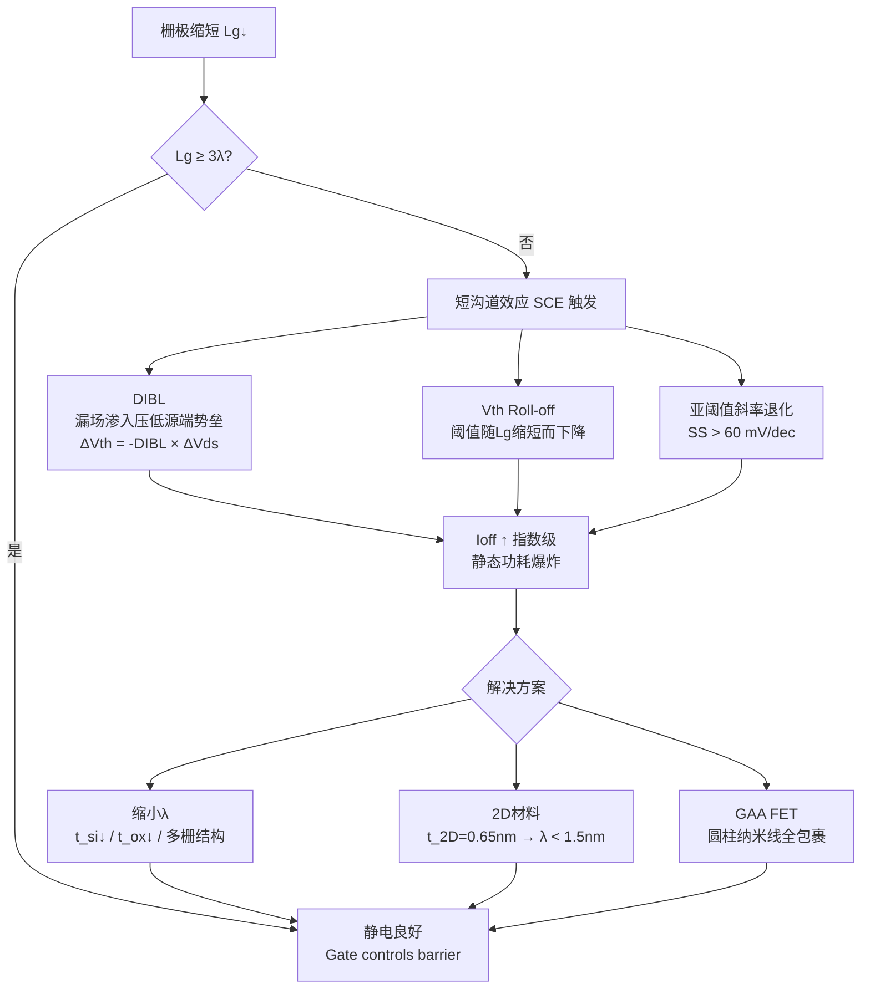

# Channel Carrier Mobility and Drain-Induced Barrier Lowering (DIBL)
> **中文概念**：*沟道载流子迁移率与漏致势垒降低*

---

## 🖼️ Hero Visual 1 — DIBL 物理机制：短沟道 MOSFET 导带势垒图

*图 1：短沟道 MOSFET 导带能量剖面图。实线（$V_{DS}=0$）时源端势垒峰高，栅极完全控制沟道导通；虚线（$V_{DS}=V_{DD}$）时漏端电场渗入沟道，压低源端势垒 $\Delta\phi_B$，等效为 $V_{th}$ 下降——此即漏致势垒降低 (DIBL)。右上方能带图对比了两种偏置下的 $E_c$、$E_f$、$E_v$ 分布。*

---

## 🖼️ Hero Visual 2 — 沟道迁移率：三大散射机制与 μ-E 关系

*图 2：Si/SiO₂ 界面附近的散射机制 3D 示意图。声学/光学声子散射主导室温低场；界面陷阱电荷（Coulomb 散射）在低温/低载流子密度时显著；界面粗糙度散射（SR）在高垂直电场强反型时主导。插图展示总迁移率 $\mu_{total}$ 随有效垂直场 $E_{eff}$ 的变化关系——由 Matthiessen 定则合成。*

---

## 1. 问题背景与文献原句 (Originating Context & Excerpt)

**[EN]** In both Liu *et al.* (2021) and Cheng *et al.* (2022), channel mobility and DIBL appear as two of the most frequently cited figures-of-merit when benchmarking 2D-material transistors against Si CMOS. Yet their physical roles differ fundamentally: **mobility** characterises the intrinsic scattering landscape of the channel material, while **DIBL** characterises the quality of electrostatic gate control as device dimensions shrink.

**[CN]** 在 Benchmark 文献中，迁移率和 DIBL 是评价二维晶体管性能的核心指标，但物理含义截然不同：迁移率反映材料本征散射特性，DIBL 反映器件在缩微后的静电门控质量。理解两者的物理机制、提取方法以及在短沟道器件中的地位，是阅读 Benchmark 论文的前提。

---

## 2. 物理机制与微观原理解析 (Physical Mechanism & Working Principles)

### A. 沟道载流子迁移率 (Channel Carrier Mobility)

**基本定义**：迁移率描述载流子在弱电场 $E$ 下的漂移能力：

$$\mu = \frac{v_d}{E} \quad \left[\text{cm}^2/\text{V·s}\right]$$

**三大散射机制（Matthiessen 定则）**：

$$\frac{1}{\mu_{eff}} = \frac{1}{\mu_{phonon}} + \frac{1}{\mu_{Coulomb}} + \frac{1}{\mu_{SR}}$$

| 散射机制 | 物理来源 | 主导条件 | 温度依赖 |
|---|---|---|---|
| 声学声子散射 | 晶格热振动随机碰撞 | 室温、中等垂直场 | $\mu \propto T^{-3/2}$ |
| 库仑散射 | 界面陷阱电荷 $D_{it}$、固定氧化物电荷 | 低温、低载流子密度 | $\mu \propto T^{+1}$ |
| 界面粗糙度散射 (SR) | Si/SiO₂ 界面原子级凸起 | 高垂直电场（强反型） | $\mu_{SR} \propto E_\perp^{-2}$ |

**两种实验提取方式**：

$$\mu_{FE} = \frac{g_m}{C_{ox} V_{DS}} \cdot \frac{L}{W} \quad \text{（场效应迁移率，含串联电阻误差）}$$

$$\mu_{eff} = \frac{I_{DS} \cdot L}{W \cdot Q_{inv} \cdot V_{DS}} \quad \text{（有效迁移率，需 split-CV 测量，更准确）}$$

**短沟道极限下迁移率的失效**：短沟道（$L_g < 20$ nm）器件进入准弹道输运区，$I_{DS}$ 不再正比于 $\mu$，而由**源端注入速度 $v_{inj}$** 主导：

$$I_{DS} \approx W \cdot C_{inv} \cdot v_{inj} \cdot (V_{GS} - V_{th})$$

**2D 材料特殊性**：MoS₂ 等 2D 材料中弯曲声学声子（ZA 模）散射贡献大，室温本征 $\mu \approx 100\text{–}200$ cm²/V·s。h-BN 封装可抑制库仑散射，将迁移率推高至 ≈ 1000 cm²/V·s（声子散射极限）。

---

### B. 漏致势垒降低 (Drain-Induced Barrier Lowering, DIBL)

**物理图像**：长沟道时，源端势垒（阻挡电子注入的能量"山丘"）完全由栅极控制。当沟道缩短至与耗尽层深度可比时，漏端高电场直接穿越沟道、压低源端势垒，等效为阈值电压下移：

$$\phi_{barrier}(V_{DS}) = \phi_{barrier,0} - \alpha \cdot V_{DS}$$

**定量定义**：

$$\text{DIBL} = -\frac{\Delta V_{th}}{\Delta V_{DS}} \quad [\text{mV/V}]$$

**实验提取**（标准协议）：

$$\text{DIBL} = \frac{V_{th}(V_{DS}=0.05\text{ V}) - V_{th}(V_{DS}=0.7\text{ V})}{0.7 - 0.05} \approx \frac{\Delta V_{th}}{0.65} \quad [\text{mV/V}]$$

**静电尺度长度 $\lambda$ 的决定性作用**——抑制 DIBL 要求 $L_g \gtrsim 3\lambda$：

| 器件结构 | $\lambda$ 量级 | DIBL 抑制能力 |
|---|---|---|
| 单栅平面 FET | ~5–10 nm | 差（需 $L_g > 30$ nm） |
| FinFET / DG-FET | ~2–5 nm | 中 |
| GAA FET（纳米线） | ~1–3 nm | 好 |
| 2D 半导体 FET（$t_{2D}=0.65$ nm） | **< 1.5 nm** | **极好（$L_g$ 可缩至 < 5 nm）** |

---

### C. Mermaid 流程图：短沟道效应 (SCE) 全景

---

## 3. 传统硅基技术对照 (Silicon Microelectronics Analogy)

| 物理量 | Si CMOS (先进节点) | 2D 半导体 FET | 优势归属 |
|---|---|---|---|
| 沟道迁移率 $\mu_e$ | 1400 cm²/Vs（体）→ ~300（强反型） | 10–200 cm²/Vs | **Si 胜** |
| 注入速度 $v_{inj}$ | $\sim 2\times10^7$ cm/s | ≈ $10^7$ cm/s（待验证） | **Si 略胜** |
| 静电尺度长度 $\lambda$（DG） | ~2 nm (FinFET) | **< 1 nm (MoS₂)** | **2D 胜** |
| DIBL（5 nm $L_g$） | 150–200 mV/V | < 80 mV/V（理论） | **2D 胜** |
| 最小可行 $L_g$ | ~7 nm（量产） | ~1–2 nm（理论极限） | **2D 潜力巨大** |
| 界面态密度 $D_{it}$ | $10^{10}$ cm⁻²eV⁻¹（Si/SiO₂ 近完美） | $10^{12}$–$10^{13}$（库仑散射强） | **Si 胜** |

**核心洞见**：2D 材料因原子级薄体厚 $t_{2D}=0.65$ nm，其静电优势（低 DIBL）天然存在；但迁移率和界面质量仍落后于 Si，是当前主要工程挑战。

---

## 4. 关键实验与提取方法 (Experimental Metrology & Characterization)

1. **迁移率提取（split-CV 法）**：
   - 分别测量 $I_{DS}$-$V_{GS}$（输运）与 $Q_{inv}$-$V_{GS}$（电容，split-C 法），计算 $\mu_{eff}$
   - 必须扣除接触电阻 $R_c$ 影响，否则 $\mu_{FE}$ 严重低估

2. **DIBL 提取（双漏压转移曲线法）**：
   - 在 $V_{DS} = 0.05$ V 和 $V_{DS} = 0.7$ V 下分别测 $I_D$-$V_G$ 曲线
   - 用恒定电流法（如 $I_D = 10^{-7} \times W/L$）定义两个 $V_{th}$，取差值除以 $\Delta V_{DS}$

3. **器件质量判定标准**（来自 Cheng 2022 Benchmark）：
   - 优质：DIBL < 60 mV/V，SS < 70 mV/dec
   - 可接受：DIBL < 100 mV/V
   - 不合格（需标注）：DIBL > 200 mV/V

---

## 5. 局限性与开放挑战 (Limitations & Future Challenges)

- **迁移率局限**：
  - 2D 材料中弯曲声子（ZA 模）散射难以从工艺上消除
  - 真空封装虽提升迁移率，但与 BEOL 兼容性差（400°C 热预算限制）
  - 短沟道器件中 $\mu_{eff}$ 提取误差显著增大（接触电阻可比沟道电阻）

- **DIBL 局限**：
  - 2D 材料中高 $D_{it}$ 会导致亚阈值斜率退化，与 DIBL 耦合难分离
  - 超短沟道（$L_g < 5$ nm）时量子隧穿（Band-to-Band Tunneling, BTBT）导致 $I_{off}$ 上升，与 DIBL 效果叠加
  - 二维材料的介电屏蔽较弱，漏端电场渗入更深，DIBL 实测值往往高于模拟预测

---

## 6. 双向链接与参考文献 (Bidirectional Links & References)

- [[Sources/Papers/2021_Liu_2D-Transistors]] — MoS₂ FET 中的 DIBL 实测与静电尺度长度分析
- [[Sources/Papers/2022_Cheng_FET-Benchmark]] — Benchmark 协议中 DIBL 的提取规范与筛选标准
- [[Knowledge/Concepts/two_dimensional_transistor_scaling]] — 静电尺度长度 $\lambda$ 与 $t_{2D}$ 的关系
- [[Knowledge/Concepts/emerging_fet_benchmarking]] — DIBL 在 FET 性能基准体系中的位置
- [[Knowledge/Concepts/contact_resistance_extraction]] — 短沟道时 $R_c$ 与沟道电阻可比，迁移率提取失效
- [[Knowledge/Comparisons/2d_electrostatic_scaling_vs_silicon_gaafet]] — 2D FET vs. Si GAA-FET 静电对照表
