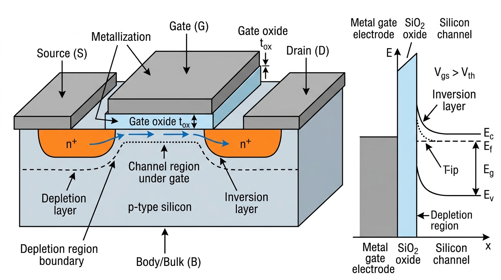
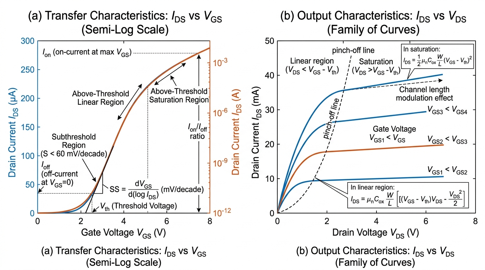
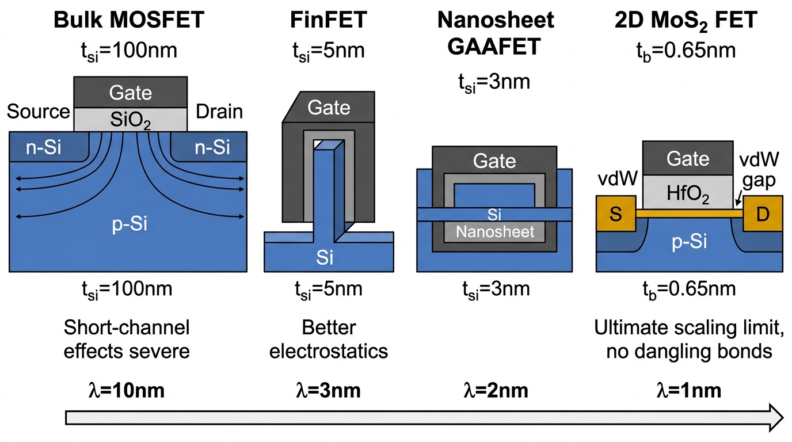
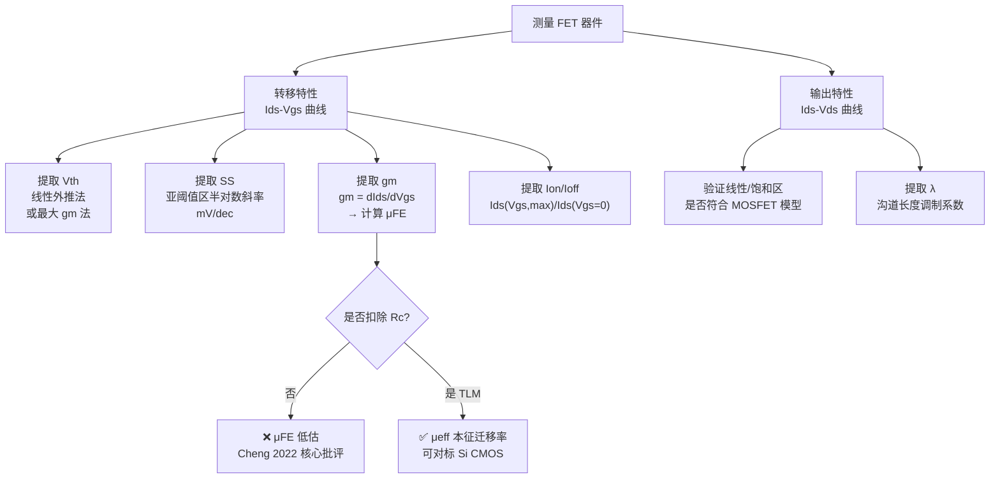

# FET and MOSFET Fundamentals
> **中文概念**：*场效应晶体管（FET）与 MOSFET 基础知识体系——从器件结构、工作原理到二维半导体的演进*

---

## Hero Visual 1 — MOSFET 器件结构 & 能带图

*图 1：左为 n-MOSFET 三维截面图，展示 p-Si 衬底、n⁺ 源极/漏极、SiO₂ 栅氧（厚度 $t_{ox}$）、金属栅电极、耗尽区边界与反型层。右为 $V_{GS} > V_{th}$ 时从金属栅穿过 SiO₂ 进入 Si 沟道的能带图，展示能带弯曲、$E_c/E_v/E_f$ 位置及沟道表面反型层电子积累。*

---

## Hero Visual 2 — 转移特性（$I_{DS}$-$V_{GS}$）& 输出特性（$I_{DS}$-$V_{DS}$）曲线

*图 2：左为转移特性（半对数坐标），标注阈值电压 $V_{th}$、亚阈值摆幅 $SS$（mV/dec）、$I_{on}$、$I_{off}$、开关比 $I_{on}/I_{off}$。右为输出特性族曲线（$I_{DS}$-$V_{DS}$，不同 $V_{GS}$ 下），标注线性区、饱和区（以夹断线分隔）、饱和电流公式及沟道长度调制效应（saturation 区微弱斜率 $\lambda I_{DS}$）。*

---

## Hero Visual 3 — FET 结构代际演进：Bulk Si → FinFET → GAAFET → 2D MoS₂

*图 3：四代器件截面对比——Bulk MOSFET（$t_{si}$=100 nm，$\lambda$=10 nm，短沟道效应严重）→ FinFET（$t_{si}$=5 nm，$\lambda$=3 nm）→ Nanosheet GAAFET（$t_{si}$=3 nm，$\lambda$=2 nm）→ 单层 2D MoS₂ FET（$t_b$=0.65 nm，$\lambda$=1 nm，无悬挂键，终极静电缩放极限）。$\lambda$ 值逐代减小代表对短沟道效应的抑制能力逐代提升。*

---

## Definition — FET 工作原理与基本定义

**[EN]** A Field-Effect Transistor (FET) is a voltage-controlled current switch in which the conductance of a semiconductor channel between the source and drain electrodes is modulated by an electric field applied through a gate electrode capacitively coupled via a thin dielectric layer. The MOSFET (Metal-Oxide-Semiconductor FET) is the dominant variant, forming the building block of all modern integrated circuits.

**[CN] Feynman 类比 — FET 是"电子水龙头"**：
- **漏极（Drain）**：水管出口，电流流出端
- **源极（Source）**：水管进口，载流子注入端
- **栅极（Gate）**：旋钮，通过**静电场**（不消耗电流！）控制开关大小
- **衬底（Body/Bulk）**：水管壁，MOSFET 中为 p-Si，通常接最低电位

**四端口结构**：

| 端口 | 符号 | 作用 |
|---|---|---|
| 栅极 | G | **控制**端，施加电压感应沟道载流子 |
| 源极 | S | **载流子来源**，NMOS 中电子从 S 注入沟道 |
| 漏极 | D | **载流子收集**，电流从 D 流出 |
| 衬底 | B | 体接触，影响阈值电压（体效应）|

---

## Mathematical Formulation — 核心公式与工作区间

### A. 阈值电压 $V_{th}$

$$V_{th} = V_{FB} + 2\phi_F + \frac{\sqrt{2\varepsilon_{Si} q N_A (2\phi_F)}}{C_{ox}}$$

- $V_{FB}$：平带电压（消除功函数差与界面电荷）
- $2\phi_F$：强反型条件（表面势 = 两倍费米势）
- 第三项：耗尽层电荷 $Q_{dep}$ 需要的额外栅压

### B. 三工作区电流公式

**亚阈值区**（$V_{GS} < V_{th}$，扩散电流主导）：
$$I_{DS} = I_0 \exp\!\left(\frac{q(V_{GS}-V_{th})}{nkT}\right), \quad n = 1 + \frac{C_{dep}}{C_{ox}} \geq 1$$

**线性区**（$V_{GS} > V_{th}$，$V_{DS} < V_{GS}-V_{th}$）：
$$I_{DS} = \mu_{eff} C_{ox} \frac{W}{L}\!\left[(V_{GS}-V_{th})V_{DS} - \frac{V_{DS}^2}{2}\right]$$

**饱和区**（$V_{DS} \geq V_{GS}-V_{th}$，夹断）：
$$I_{DS} = \frac{1}{2}\mu_{eff} C_{ox} \frac{W}{L}(V_{GS}-V_{th})^2 \cdot (1 + \lambda V_{DS})$$

其中 $\lambda$ 为**沟道长度调制系数**（导致饱和区电流随 $V_{DS}$ 微弱上升）。

### C. 亚阈值摆幅 $SS$（物理极限）

$$SS = \frac{\partial V_{GS}}{\partial \log_{10} I_{DS}} = \ln(10)\frac{nkT}{q} \geq \underbrace{60\ \text{mV/dec}}_{\text{300 K 玻尔兹曼极限}}$$

$SS < 60$ mV/dec 意味着器件在"关"时比在"开"时还快地响应栅压——这是经典 MOSFET 无法突破的极限（需要隧穿 FET 或铁电栅才能突破）。

### D. 关键工作参数一览

| 参数 | 符号 | 典型值（先进 Si CMOS） | 物理含义 |
|---|---|---|---|
| 阈值电压 | $V_{th}$ | 0.3–0.5 V | 沟道开启所需栅压 |
| 亚阈值摆幅 | $SS$ | 65–80 mV/dec | 电流增大10倍所需 $\Delta V_{GS}$ |
| 开关比 | $I_{on}/I_{off}$ | $10^4$–$10^8$ | 数字逻辑对比度 |
| 开态电流 | $I_{on}/W$ | 1–3 mA/μm | 驱动能力 |
| 跨导 | $g_m/W$ | 3–5 mS/μm | 栅控电流灵敏度 |
| 接触电阻 | $R_c \cdot W$ | < 50 Ω·μm | 金属-半导体接触质量 |

---

## 3. 短沟道效应与器件结构演进对照 (Silicon Microelectronics Analogy)

### 短沟道效应（SCE）根源

**静电特征长度 $\lambda$**——决定晶体管最小可用栅长：

$$\lambda = \sqrt{\frac{\varepsilon_b}{\varepsilon_{ox}} \cdot t_b \cdot t_{ox}}$$

规则：$L_g > 3\lambda$（通常要求），才能保证栅极主导沟道电位，抑制短沟道效应。

**四大短沟道效应**：

| 效应 | 英文 | 物理机制 | 表现 |
|---|---|---|---|
| DIBL | Drain-Induced Barrier Lowering | 漏电场渗入沟道，降低源端势垒 | $V_{th}$ 随 $V_{DS}$ 下降 |
| SS 退化 | SS Degradation | $n$ 因子增大（$n > 1$） | $SS > 60$ mV/dec |
| 穿通 | Punch-through | 源漏耗尽区合并 | $I_{off}$ 爆增 |
| 速度饱和 | Velocity Saturation | 高场下载流子达到 $v_{sat}$ | $I_{on}$ 增速放缓 |

### 四代器件结构对比

| 器件 | 年代 | $t_b$ | $\lambda$ | 栅结构 | 特点 |
|---|---|---|---|---|---|
| Bulk MOSFET | ~2000s | 100 nm | ~10 nm | 平面单栅 | 简单，SCE 严重 |
| FinFET | 2012+ | 5 nm | ~3 nm | 三面包围 | 好静电，Intel 22 nm 首发 |
| Nanosheet GAAFET | 2025+ | 3 nm | ~2 nm | 四面全包围 | 最先进 Si 节点 |
| 2D MoS₂ FET | 研究中 | **0.65 nm** | **~1 nm** | Top-gate/vdW | 终极缩放极限 |

### 2D 半导体的核心优势与挑战

**优势**：
- $t_b = 0.65$ nm（单层 MoS₂），**原子级厚度**，$\lambda$ 可达 < 1 nm
- **无悬挂键**表面（范德华层间力），界面态 $D_{it}$ 极低（理论上）
- 大带隙（MoS₂ 1.8 eV，WSe₂ 1.7 eV），$I_{off}$ 热激发小

**挑战**（Benchmark 核心问题）：
- 接触电阻 $R_c \cdot W > 1000\ \Omega\cdot\mu\text{m}$（Si 已达 < 50），根因是**费米能级钉扎**（MIGS）
- 量子电容 $C_Q \approx C_{ox}$，限制 $g_m$ 提升上限
- 晶圆级单晶生长技术尚未成熟（缺陷密度高）
- $I_{on}/W$ 目前约 0.1–0.5 mA/μm，距 IRDS 目标（> 1 mA/μm @ $V_{DD}$ = 0.7 V）尚差约一个数量级

---

## 4. 实验参数提取方法 (Experimental Metrology & Characterization)

---

## 5. 局限性与开放问题 (Limitations & Future Challenges)

- **Si 接触工艺的不可简单移植**：硅的离子注入+自对准硅化物接触（NiSi/TiSi）无法直接用于 2D 材料（高能粒子会破坏原子级薄层）
- **$SS$ 的玻尔兹曼极限**：室温 60 mV/dec 是经典 MOSFET 的物理下限，低功耗芯片需要隧穿 FET（TFET）或负电容 FET（NC-FET）才能突破
- **$p$ 型器件**：2D 材料的 n 型器件（MoS₂）发展领先，但互补逻辑所需的 $p$ 型器件（WSe₂、黑磷）性能滞后，接触势垒高
- **可靠性与均一性**：实验室样品与晶圆级量产之间的性能均一性差距巨大

---

## 6. 双向链接与参考文献 (Bidirectional Links & References)

- [[Sources/Papers/2021_Liu_2D-Transistors]] — 二维晶体管 $\lambda$ 缩放方程、$I_{on}/W$ 弹道极限分析
- [[Sources/Papers/2022_Cheng_FET-Benchmark]] — MOSFET 参数标准提取规范、基准对比方法论
- [[Knowledge/Concepts/channel_mobility_and_dibl]] — $\mu_{eff}$ 与 DIBL 的微观物理，与 $SS$ 退化的关系
- [[Knowledge/Concepts/transconductance_gm_in_fet]] — $g_m$ 提取与 $\mu_{FE}$ 的计算链路
- [[Knowledge/Concepts/contact_resistance_extraction]] — TLM 方法提取 $R_c$，去嵌套 $\mu_{eff}$
- [[Knowledge/Concepts/emerging_fet_benchmarking]] — $I_{on}/W$、$SS$、$R_c$ 等参数的对标体系
- [[Knowledge/Concepts/two_dimensional_transistor_scaling]] — $\lambda$ 方程推导与 2D vs Si 缩放对比
- [[Knowledge/Comparisons/2d_electrostatic_scaling_vs_silicon_gaafet]] — 静电缩放对照卡片
- [[Knowledge/Comparisons/2d_contact_vdW_vs_silicon_silicide]] — 接触工程对照卡片