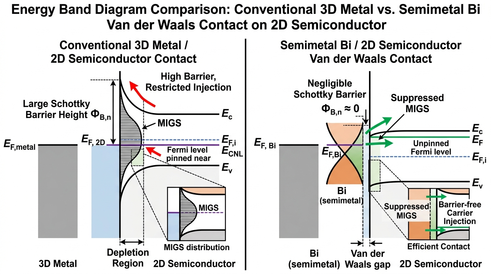

# Interface State Density & Fermi-Level Pinning in 2D Transistors
> **中文概念**：*二维晶体管界面态密度与费米能级钉扎机理*

---

## 🖼️ 费米能级钉扎与半金属能带去钉扎微观对比图

*图 1：金属-二维半导体界面能带对比图。（左）传统 3D 金属接触引起金属诱导间隙态（$\text{MIGS}$），费米能级被牢牢钉扎在电荷中性能级 $E_{CNL}$ 附近，形成巨大的肖特基势垒 $\Phi_{B,n}$；（右）半金属铋（$\text{Bi}$）接触有效抑制 $\text{MIGS}$，费米能级与导带对齐，实现零势垒欧姆电子注入。*

---

### 🔍 能带对比图微观物理深度拆解：
1. **传统 3D 金属 / 二维界面（左图）**：
   - **MIGS 态密度分布**：金属自由电子波函数穿透范德华间隙在禁带中形成指数衰减态，在电荷中性能级 $E_{CNL}$ 附近累积高密度界面态。
   - **势垒高度与钉扎**：肖特基势垒高度 $\Phi_{B,n}$ 完全脱离金属功函数调控（钉扎因子 $S \to 0$），导致接触电阻居高不下（$R_c > 10^3\ \Omega\cdot\mu\text{m}$）。
2. **半金属铋 (Bi) / 范德华界面（右图）**：
   - **MIGS 消除与能带对齐**：半金属铋在费米能级处的态密度趋近于零，大幅削弱金属波函数渗透，抑制间隙态电荷累积。
   - **零势垒欧姆注入**：费米能级与导带底 $E_c$ 自然对齐，肖特基势垒 $\Phi_{B,n} \approx 0$，载流子实现无阻挡直接量子隧穿注入。

---

## 1. 问题背景与文献原句 (Originating Context & Excerpt)
- **文献出处**：[[Sources/Papers/2021_Liu_2D-Transistors]]
- **精读疑问**：为什么传统蒸镀金属在二维半导体表面会形成极高的接触电阻？金属诱导间隙态（MIGS）是如何导致费米能级钉扎的？
- **文献原句摘录**：
  > [!quote] 文献原句摘录 (Excerpt)
  > "Wavefunctions of metallic states penetrate into the van der Waals gap and the semiconductor bandgap, generating a continuum of metal-induced gap states (MIGS) that pin the Fermi level near the charge neutrality level."

---

## 2. 物理机制与微观原理解析 (Physical Mechanism & Working Principles)
- **[EN]**: In metal-semiconductor junctions, evanescent decaying metal wavefunctions penetrate across the van der Waals interface into the 2D forbidden bandgap, creating a continuum of metal-induced gap states (MIGS). The interface dipole drives Fermi-level pinning near the charge neutrality level ($E_{CNL}$), yielding an invariant Schottky barrier height regardless of metal workfunction.
- **[CN] 物理机制与核心内涵**: 即使在无原子缺陷的理想接触下，金属三维自由电子波函数在界面处发生渐逝衰减（Evanescent decay），其指数衰减尾部穿透范德华间隙进入半导体禁带，形成金属诱导间隙态（MIGS）。界面电荷中性能级 $E_{CNL}$ 处的态密度 $D_{it}$ 决定了钉扎因子 $S$。当 $D_{it}$ 极高时，$S \to 0$（Bardeen 极限），导致肖特基势垒高度完全脱离金属真空功函数的调控。

### 核心物理方程：
- **钉扎因子与界面态方程 (Cowley-Sze Model)**：
  $$
  S = \frac{\partial \Phi_{Bn}}{\partial \Phi_M} = \frac{1}{1 + \frac{q^2 \delta D_{it}}{\varepsilon_i}}
  $$
  *(式中 $\delta$ 为界面范德华间隙厚度，$D_{it}$ 为间隙态密度。当 $D_{it} > 10^{13}\text{ eV}^{-1}\text{cm}^{-2}$ 时，$S \to 0$，形成强费米能级钉扎)*

---

## 3. 传统硅基技术对照 (Silicon Microelectronics Analogy)
- **硅基对照与工程映射**: 硅基微电子采用高温合金化自对准硅化物（NiSi/TiSi）使金属与硅形成共价键反应，并通过源漏重掺杂（$N_d > 10^{20}\text{ cm}^{-3}$）将势垒区宽度压缩至亚纳米级实现场致发射隧穿；二维半导体缺乏化学键且极薄无法承受离子注入，必须采用半金属（Bi/Sb）或二维层间范德华转移接触技术消除 MIGS。

---

## 4. 关键实验与提取方法 (Experimental Metrology & Characterization)
- **测试方法**:
  1. 变金属功函数测试肖特基势垒高度，绘制 $\Phi_{Bn}$ vs. $\Phi_M$ 直线斜率提取钉扎因子 $S$；
  2. 变温电学输运测试（Richardson 曲线）测定有效势垒高度；
  3. 低温扫描隧道谱（STS）直接探测空间分辨的界面间隙态态密度。

---

## 5. 局限性与开放挑战 (Limitations & Future Challenges)
- **工程瓶颈**: 半金属铋（Bi）熔点低（$271^\circ\text{C}$），无法承受后续芯片制造热预算；低功函数金属（Sc/Y）在大气中极易氧化退化。

---

## 6. 双向链接与参考文献 (Bidirectional Links & References)
- [[Sources/Papers/2021_Liu_2D-Transistors]]
- [[Knowledge/Concepts/contact_resistance_extraction]]
- [[Knowledge/Comparisons/2d_contact_vdW_vs_silicon_silicide]]
