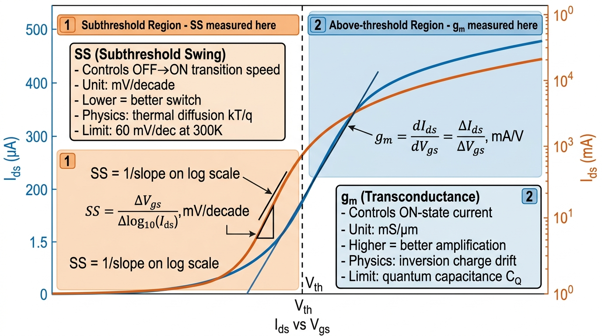
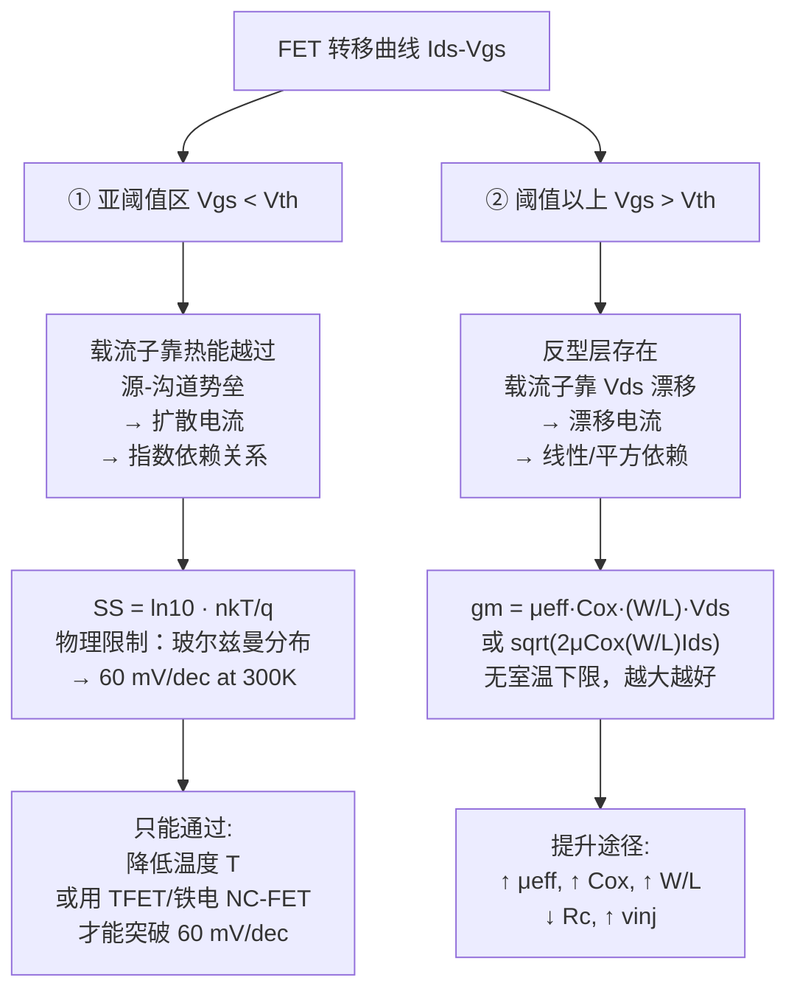

# Subthreshold Swing vs Transconductance — SS and gm Compared
> **中文概念**：*亚阈值摆幅（SS）与跨导（gm）的本质区别——同一条转移曲线，两段完全不同的物理*

---

## Hero Visual — 同一条曲线，两个完全不同的工作区与斜率含义

*图：同一条 $I_{DS}$-$V_{GS}$ 转移曲线，左侧橙色区（$V_{GS} < V_{th}$）为 SS 测量区——在**对数坐标**下取斜率的倒数，单位 mV/decade；右侧蓝色区（$V_{GS} > V_{th}$）为 $g_m$ 测量区——在**线性坐标**下取斜率，单位 mS/μm。两者分别刻画"关→开转变效率"和"开态电流放大效率"，物理机制截然不同。*

---

## Definition — 核心区别一句话定义

**[EN]** Both SS and $g_m$ describe how gate voltage modulates drain current, but they operate in **fundamentally different regimes**:
- **SS** (Subthreshold Swing): measured **below** $V_{th}$ in the OFF-state — quantifies how efficiently the gate can *switch the transistor on* (thermal diffusion regime).
- **$g_m$** (Transconductance): measured **above** $V_{th}$ in the ON-state — quantifies how efficiently the gate can *drive more current* once the transistor is already on (drift regime).

**[CN] 一句话核心区别**：
- $SS$ 问的是：**"关→开的转变要消耗多少栅压？"**（越小越好，表示开关越灵敏）
- $g_m$ 问的是：**"开态下，多加一点栅压能多拉多少电流？"**（越大越好，表示驱动能力越强）

**精确对比表**：

| 维度 | $SS$（亚阈值摆幅） | $g_m$（跨导） |
|---|---|---|
| **工作区间** | $V_{GS} < V_{th}$（**关态**） | $V_{GS} > V_{th}$（**开态**） |
| **斜率坐标** | $\Delta V_{GS} / \Delta\log_{10}(I_{DS})$（对数轴） | $\Delta I_{DS} / \Delta V_{GS}$（线性轴） |
| **主导物理** | 热扩散（Boltzmann 分布） | 反型层载流子漂移（drift） |
| **越 __ 越好** | 越**小**越好 | 越**大**越好 |
| **单位** | mV/decade | mS/μm（mA/V） |
| **物理极限** | 60 mV/dec（室温玻尔兹曼壁） | 受 $C_Q$、$v_{inj}$、$R_c$ 限制 |
| **优化目标** | 低 $I_{off}$、低静态功耗 | 高 $I_{on}$、高频率响应 $f_T$ |

---

## Mathematical Formulation — 公式推导与物理极限

### A. 亚阈值摆幅 SS 的推导

亚阈值区无反型层，电流由**热激发扩散**主导：

$$I_{DS} = I_0 \exp\!\left(\frac{q V_{GS}}{n k T}\right), \quad n = 1 + \frac{C_{dep}}{C_{ox}}$$

对 $V_{GS}$ 取对数导数，得到 SS 的定义：

$$SS \equiv \frac{\partial V_{GS}}{\partial \log_{10} I_{DS}} = \ln(10) \cdot \frac{n k T}{q}$$

**室温（300 K）下的物理极限**（$n = 1$ 时）：

$$SS_{\min} = \ln(10) \cdot \frac{kT}{q} \approx 60\ \text{mV/dec}$$

> $n$（理想因子）的含义：$n = 1 + C_{dep}/C_{ox}$，耗尽层电容 $C_{dep}$ "分走"了一部分栅压，使实际控制表面势的电压小于施加的 $V_{GS}$。$n$ 越接近 1（薄体好静电），SS 越接近 60 mV/dec。

### B. 跨导 $g_m$ 的推导

阈值以上，反型层存在，电流由**漂移**主导：

**线性区**（$V_{DS}$ 小）：
$$I_{DS} = \mu_{eff} C_{ox} \frac{W}{L} \left[(V_{GS}-V_{th})V_{DS} - \frac{V_{DS}^2}{2}\right]$$
$$g_m = \frac{\partial I_{DS}}{\partial V_{GS}} = \mu_{eff} C_{ox} \frac{W}{L} V_{DS}$$

**饱和区**（$V_{DS}$ 大）：
$$I_{DS} = \frac{1}{2}\mu_{eff}C_{ox}\frac{W}{L}(V_{GS}-V_{th})^2$$
$$g_m = \mu_{eff} C_{ox} \frac{W}{L} (V_{GS}-V_{th}) = \sqrt{2\mu_{eff}C_{ox}\frac{W}{L}I_{DS}}$$

**限制 $g_m$ 的三大因素**：
1. **有效迁移率 $\mu_{eff}$**：受散射（声子、库仑、界面粗糙）限制
2. **量子电容 $C_Q$**（2D 材料关键）：$C_{eff} = C_{ox} \| C_Q$，态密度低时 $C_Q \ll C_{ox}$，分压效应严重
3. **接触电阻 $R_c$**：外部串联 $R_c$ 使实际 $V_{GS}$ 压降在接触，测到的"外部 $g_m$"远小于本征值

### C. 两者的数学联系

SS 实际上是亚阈值区的**归一化跨导效率**：

$$SS = \frac{\ln 10}{g_{m,sub} / I_{DS}}, \quad g_{m,sub} = \frac{q}{nkT} I_{DS}$$

亚阈值区 $g_{m,sub}/I_{DS} = q/(nkT)$ 是常数（与 $I_{DS}$ 无关），SS 就是这个常数的倒数换算。

---

## 3. 物理根源深入对照 (Mechanism Comparison)

---

## 4. 在二维半导体中的特殊表现 (2D Materials Context)

| 维度 | Si FinFET | 2D MoS₂ FET |
|---|---|---|
| **SS 现状** | 65–80 mV/dec（接近理想） | **理论上可达 ~60 mV/dec**（薄体好电场，$n \to 1$），实验中受界面态 $D_{it}$ 影响 |
| **$g_m$ 现状** | 3–5 mS/μm（先进节点） | 0.1–0.5 mS/μm（**严重受限**） |
| **$g_m$ 瓶颈** | 接触电阻为主 | 量子电容 $C_Q$ + 接触电阻 $R_c$ **双重**限制 |

**量子电容瓶颈**（2D 材料独有）：
MoS₂ 单层态密度极低 → $C_Q = q^2 \cdot \text{DOS}$ 很小 → 与 $C_{ox}$ 串联分压，实际作用于沟道的电压：

$$\Delta\phi_{surf} = \frac{C_Q}{C_Q + C_{ox}} \Delta V_{GS} \ll \Delta V_{GS}$$

即使栅极对 $V_{GS}$ 控制再好（SS 好），进入开态后 $g_m$ 依然被 $C_Q$ 封顶。

**2D FET 的"好 SS 难 $g_m$"悖论**：
- SS 好（因为 $t_b$ 极薄，$n \to 1$，Cheng 2022 实测部分器件 SS < 70 mV/dec）
- $g_m$ 差（因为 $C_Q \sim C_{ox}$，加上 $R_c > 1000\ \Omega\cdot\mu\text{m}$）
- 结论：静电控制已不是瓶颈，**接触工程和量子电容才是决战的关键战场**

---

## 5. 局限性与边界条件 (Limitations & Boundary Conditions)

- **SS 的 60 mV/dec 壁**：室温下经典 MOSFET 无法突破，需要非热载流子注入机制（TFET：带间隧穿；NC-FET：铁电负电容放大表面势）
- **$g_m$ 提取依赖 $V_{DS}$**：测量时需固定 $V_{DS}$，且必须扣除 $R_c$ 压降（否则外部 $g_m$ = 本征值 × $[1/(1+g_m R_c)]$，严重低估）
- **迁移率提取陷阱**（Cheng 2022 核心批评）：用 $\mu_{FE} = g_m L/(C_{ox} W V_{DS})$ 而不扣除 $R_c$，会使 $\mu_{FE}$ 被低估数个数量级
- **$g_m$ 的频率依赖**：高频下 $g_m$ 随频率下降（截止频率 $f_T = g_m/(2\pi C_{gs})$）

---

## 6. 双向链接与参考文献 (Bidirectional Links & References)

- [[Sources/Papers/2022_Cheng_FET-Benchmark]] — SS 和 $g_m$ 提取规范（$R_c$ 去嵌套），外部迁移率误用批评
- [[Sources/Papers/2021_Liu_2D-Transistors]] — 短沟道下 $g_m$ 的弹道极限分析，$v_{inj}$ 替代 $\mu$ 的论证
- [[Knowledge/Concepts/transconductance_gm_in_fet]] — $g_m$ 的完整物理与 2D 特殊性详细推导
- [[Knowledge/Concepts/channel_mobility_and_dibl]] — $\mu_{eff}$ 与散射机制，连接 $g_m$ 的材料物理
- [[Knowledge/Concepts/fet_mosfet_fundamentals]] — FET 完整基础体系（SS 与 $g_m$ 所在的器件全景）
- [[Knowledge/Concepts/emerging_fet_benchmarking]] — $SS$、$g_m/I_{DS}$ 等参数在基准评估中的标准用法
- [[Knowledge/Concepts/contact_resistance_extraction]] — $R_c$ 的 TLM 提取，去除 $R_c$ 影响还原本征 $g_m$