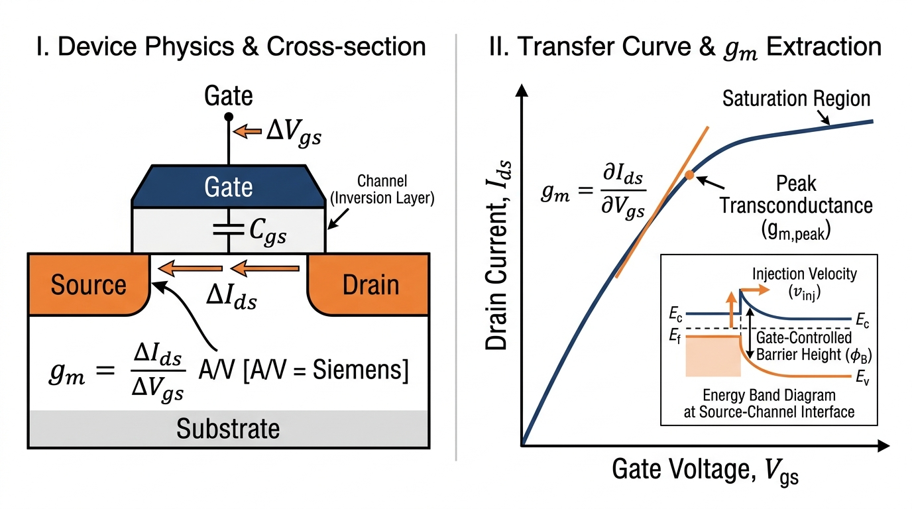
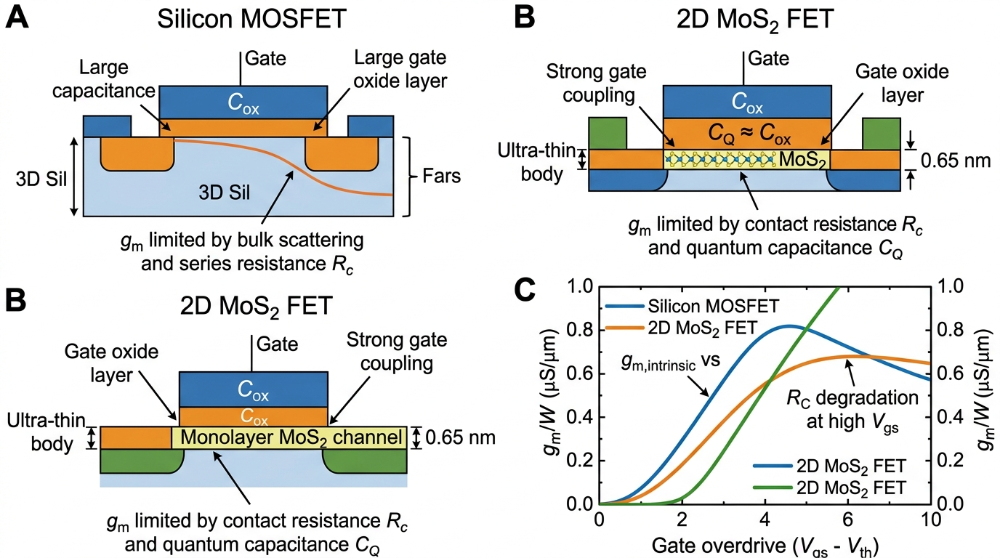
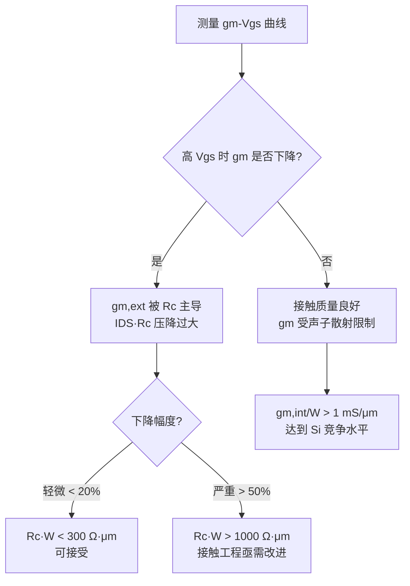

# Transconductance ($g_m$) in Field-Effect Transistors
> **中文概念**：*跨导——场效应晶体管的栅极电流控制灵敏度*

---

## 🖼️ Hero Visual 1 — $g_m$ 物理定义：转移曲线斜率与能带图

*图 1：左为 MOSFET 截面，展示 $\Delta V_{gs}$ 引起 $\Delta I_{ds}$ 变化，定义 $g_m = \Delta I_{ds}/\Delta V_{gs}$（单位：S 西门子）。右为转移曲线，跨导即切线斜率，峰值 $g_{m,peak}$ 出现在饱和区中段。插图为源端势垒能带图，展示栅压调控势垒高度 $\phi_B$ 与注入速度 $v_{inj}$。*

---

## 🖼️ Hero Visual 2 — Si MOSFET vs. 2D MoS₂ FET 跨导对比

*图 2：(A) Si MOSFET：$g_m$ 受体内散射和串联电阻限制；(B) 单层 MoS2 FET：$g_m$ 同时受 $R_c$ 和量子电容 $C_Q$（$C_Q \approx C_{ox}$）双重压制；(C) $g_m/W$ 随栅过驱动曲线，2D 器件高 $V_{GS}$ 时出现特征性 $g_m$ 下降（$R_c$ degradation）。*

---

## Definition — 基本定义与物理直觉

**[EN]** Transconductance $g_m$ quantifies how effectively the gate voltage controls the drain current at fixed drain bias. It is the key figure of merit linking gate-induced channel charge to drain current, and the essential intermediate for extracting carrier mobility.

**[CN] 物理直觉**：把 FET 想象成"电子水龙头"：漏极电流 = 水流量，栅极电压 = 旋钮角度，跨导 = 旋钮灵敏度（转动一点，水流变化多少）。

$$g_m = \frac{\partial I_{DS}}{\partial V_{GS}}\bigg|_{V_{DS}=\text{const}} \quad [\text{A/V} = \text{S}]$$

跨导越大，放大能力越强；也是提取 $\mu_{FE}$ 的核心中间量：$\mu_{FE} = g_m \cdot L / (C_{ox} \cdot W \cdot V_{DS})$。

---

## Mathematical Formulation — 数学公式与微观物理推导

### A. 长沟道漂移扩散极限

线性区：$g_m = \mu_{eff} \cdot C_{ox} \cdot (W/L) \cdot V_{DS}$

饱和区：$g_m = \mu_{eff} \cdot C_{ox} \cdot (W/L) \cdot (V_{GS} - V_{th})$

规律：$g_m \propto \mu_{eff}$，$g_m \propto C_{ox}/L$，$g_m \propto W$

### B. 短沟道弹道极限（现代器件）

$$g_m = W \cdot C_{inv} \cdot v_{inj} = W \cdot \frac{C_{ox} \cdot C_Q}{C_{ox} + C_Q} \cdot v_{inj}$$

量子电容：$C_Q = e^2 \cdot g_s g_v m^* / (\pi \hbar^2)$

对单层 MoS2（$m^* \approx 0.45 m_0$）：$C_Q \approx 2.2\,\mu\text{F/cm}^2 \approx C_{ox}$

### C. 外在 vs. 本征 $g_m$（Benchmark 论文核心批评点）

$$g_{m,ext} = \frac{g_{m,int}}{1 + g_{m,int} \cdot R_s}$$

当 $g_{m,int} \cdot R_c \gg 1$：$g_{m,ext} \approx 1/R_s$，完全由接触电阻主导，与沟道性质无关！

**这就是为什么不扣除 $R_c$ 直接用 $g_{m,ext}$ 计算的 $\mu_{FE}$ 会严重低估本征迁移率。**

---

## 3. 传统硅基技术对照 (Silicon Microelectronics Analogy)

| 参数 | Si MOSFET (sub-5 nm) | 单层 MoS2 FET | 原因分析 |
|---|---|---|---|
| $g_{m,peak}/W$ | ~3–5 mS/μm | ~0.1–1 mS/μm | $\mu$ 和 $v_{inj}$ 均低 |
| $g_m$ 衰减起始 | $V_{GS}-V_{th} > 1$ V | $V_{GS}-V_{th} > 0.3$ V | $R_c$ 大，更早衰减 |
| $C_Q$ 影响 | $C_Q \gg C_{ox}$（不成瓶颈） | $C_Q \approx C_{ox}$（严重限制） | 2D DoS 低 |
| $g_{m,int}/g_{m,ext}$ | ~1.1–1.3 | ~2–5 | 2D 的 $R_c \cdot W > 1000\,\Omega\cdot\mu\text{m}$ |

---

## 4. 关键实验与提取方法 (Experimental Metrology & Characterization)

1. 测 $I_{DS}$-$V_{GS}$ 转移曲线（固定 $V_{DS} = 50$ mV），数值微分得 $g_{m,ext}$
2. 用 TLM 提取 $R_c$，代入去嵌套公式得 $g_{m,int}$
3. 观察 $g_m$-$V_{GS}$ 峰值行为：

---

## 5. 局限性与开放挑战 (Limitations & Future Challenges)

- **接触电阻瓶颈**：2D 最佳 $R_c \cdot W \approx 123\,\Omega\cdot\mu\text{m}$，$g_{m,ext}$ 仍远低于 $g_{m,int}$；Si 已达 $< 50\,\Omega\cdot\mu\text{m}$
- **量子电容极限**：MoS2 的 $C_Q \approx 2.2\,\mu\text{F/cm}^2$ 使 $C_{inv}$ 存在理论上限，即使 EOT → 0 也无法无限提升 $g_m$
- **非线性问题**：$g_m$-$V_{GS}$ 非线性在 2D 器件中远比 Si 严重，限制模拟电路应用
- **频率特性**：截止频率 $f_T = g_m/(2\pi C_{gs})$，$g_m$ 低导致 RF 性能劣势明显

---

## 6. 双向链接与参考文献 (Bidirectional Links & References)

- [[Sources/Papers/2022_Cheng_FET-Benchmark]]
- [[Sources/Papers/2021_Liu_2D-Transistors]]
- [[Knowledge/Concepts/channel_mobility_and_dibl]]
- [[Knowledge/Concepts/contact_resistance_extraction]]
- [[Knowledge/Concepts/emerging_fet_benchmarking]]
- [[Knowledge/Comparisons/2d_electrostatic_scaling_vs_silicon_gaafet]]